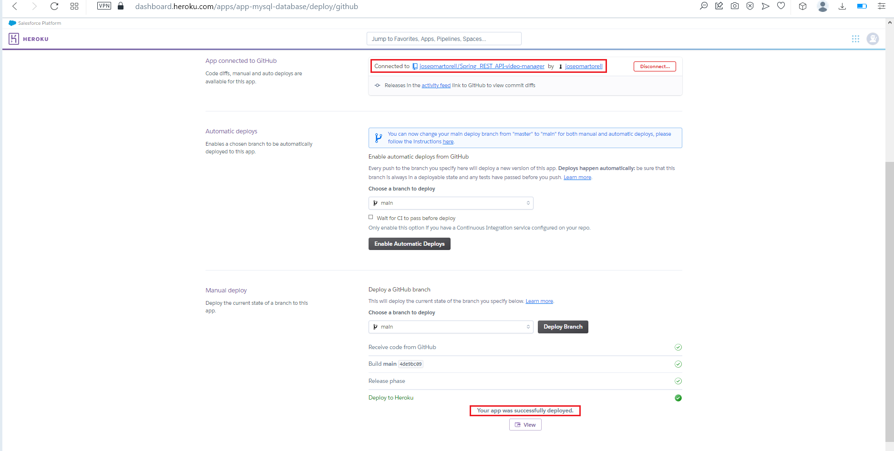
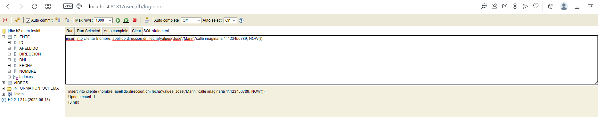
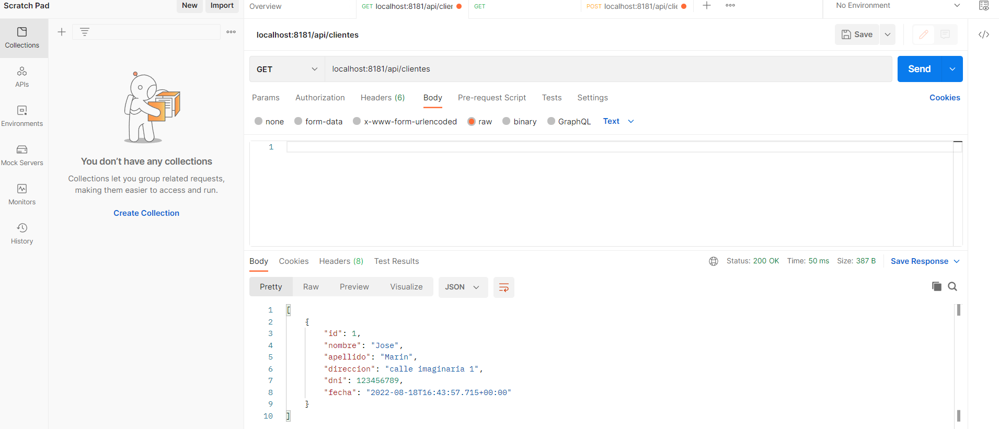

# Spring_REST_API-video-manager
Spring Project with JPA + H2 (Simple CRUD N:N) + ER with at least Entities.
#
## ENDPOINTS

## GET
server/api/clientes 
server/api/clientes/{id} 
server/api/videos 
server/api/videos/{id}
## POST
server/api/clientes 
server/api/videos
## PUT
server/api/clientes/{id} 
server/api/videos/{id}
## DELETE
server/api/clientes/{id} 
server/api/videos/{id}
##

